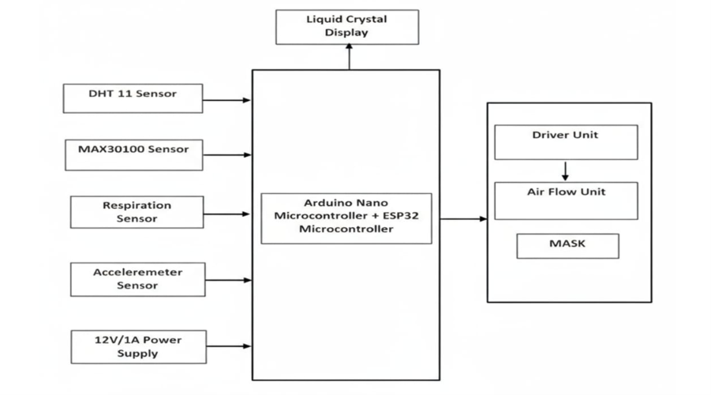
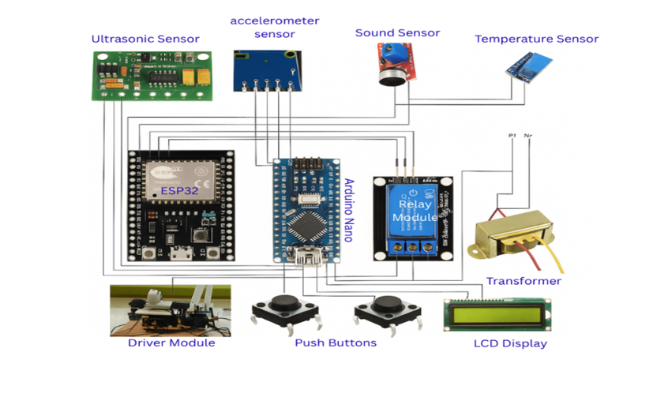
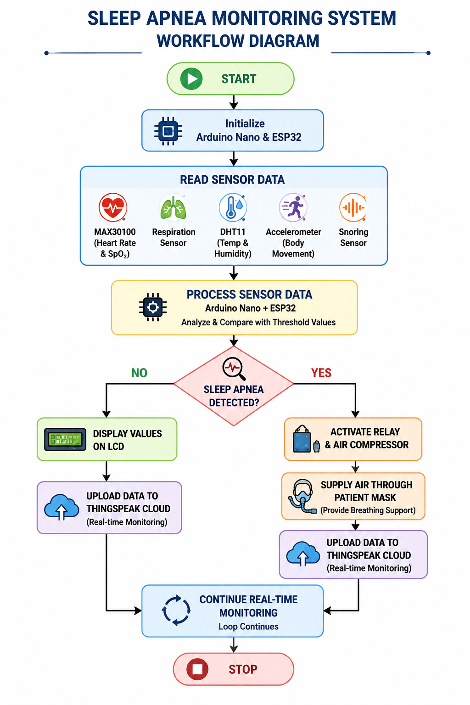

# 🚑 Intelligent IoT Solution for Sleep Apnea

> **An IoT-enabled healthcare system for real-time monitoring and early detection of Sleep Apnea using Arduino Nano, ESP32, multiple physiological sensors, and cloud-based remote monitoring.**

---

## 📖 Overview

Sleep Apnea is a serious sleep disorder in which breathing repeatedly stops during sleep. Delayed detection can lead to severe health complications including cardiovascular diseases, fatigue, and poor cognitive performance.

This project presents an **Intelligent IoT Solution for Sleep Apnea** that continuously monitors a patient's physiological parameters such as respiration, heart rate, blood oxygen level (SpO₂), temperature, humidity, body movement, and snoring. When abnormal breathing patterns are detected, the system automatically activates an airflow mechanism to help restore normal breathing while simultaneously uploading patient data to the ThingSpeak cloud platform for remote monitoring.

---

# 🎯 Objectives

* Monitor patient vital signs continuously.
* Detect Sleep Apnea events in real time.
* Automatically provide breathing assistance using an airflow mechanism.
* Upload health data to the cloud for remote monitoring.
* Reduce snoring and improve breathing during sleep.
* Provide both Automatic and Manual operating modes.

---

# ✨ Features

* 📊 Real-time health monitoring
* ❤️ Heart Rate Monitoring
* 🩸 Blood Oxygen (SpO₂) Monitoring
* 🌡 Temperature Monitoring
* 💧 Humidity Monitoring
* 🌬 Respiration Monitoring
* 🛌 Sleep Movement Detection
* 🔊 Snoring Detection
* ☁️ IoT Cloud Monitoring using ThingSpeak
* ⚡ Automatic Compressor Control
* 📟 LCD Live Status Display
* 🔄 Automatic & Manual Modes

---

# 🛠 Hardware Components

| Component          | Purpose                                    |
| ------------------ | ------------------------------------------ |
| Arduino Nano       | Sensor data acquisition and system control |
| ESP32              | Wi-Fi & Bluetooth communication            |
| MAX30100           | Heart Rate & SpO₂ Sensor                   |
| DHT11              | Temperature & Humidity Sensor              |
| Respiration Sensor | Breathing Detection                        |
| Accelerometer      | Body Movement Detection                    |
| Relay Module       | Compressor Control                         |
| Air Compressor     | Airflow Assistance                         |
| Air Mask           | Air Delivery                               |
| LCD Display        | Live Monitoring                            |
| Power Supply       | System Power                               |

---

# 💻 Software Used

* Arduino IDE
* ThingSpeak IoT Platform
* Embedded C / Arduino Programming

---

# ⚙️ Working Principle

1. The sensors continuously monitor patient health parameters.
2. Arduino Nano collects data from all connected sensors.
3. ESP32 processes the collected information and uploads it to ThingSpeak.
4. The system compares the incoming values with predefined threshold levels.
5. If Sleep Apnea is detected:

   * The compressor is activated.
   * Air is delivered through the breathing mask.
   * Patient data is continuously updated on the IoT dashboard.
6. LCD displays the real-time system status.

---

# 📡 IoT Architecture

Patient

⬇

Sensors

⬇

Arduino Nano

⬇

ESP32

⬇

ThingSpeak Cloud

⬇

Doctor / Caregiver Monitoring

---

# 📁 Repository Structure

```text
Sleep-Apnea-IoT-System/
│── README.md
│── LICENSE
│── Sleep_Apnea_System.ino
│
├── images/
│   ├── block_diagram.png
│   ├── circuit_diagram.png
│   ├── workflow.png
│   ├── prototype.jpg
│   └── output.png
│
└── components/
    └── components_list.md
```

---

# 📷 Project Images

## Block Diagram



---

## Circuit Diagram



---

## Workflow



---

## Prototype


---

# 🚀 Installation

1. Clone the repository.

```bash
git clone https://github.com/Baranidharan-Ece/Sleep-Apnea-Monitoring-using-IoT.git
```

2. Open the project using Arduino IDE.

3. Install the required Arduino libraries.

* MAX30100
* DHT Sensor Library
* ESP32 Board Package
* LiquidCrystal
* WiFi Library

4. Select the correct board and COM port.

5. Upload the code.

6. Power the hardware.

7. Monitor live data using ThingSpeak.

---

# 📊 System Flow

```text
Start
   │
Initialize Sensors
   │
Read Sensor Values
   │
Analyze Data
   │
Sleep Apnea?
   │
 ┌───────No────────┐
 │                 │
Display Values     │
 │                 │
Upload to Cloud    │
 │                 │
 └──────Yes────────┘
        │
Activate Compressor
        │
Provide Airflow
        │
Update LCD
        │
Upload Data
        │
Repeat
```

---

# ✅ Advantages

* Low Cost
* Non-invasive
* Real-time Monitoring
* IoT Enabled
* Remote Healthcare Support
* Automatic Detection
* Early Medical Intervention
* Easy to Use

---

# 🔮 Future Scope

* Mobile Application Integration
* AI-based Sleep Apnea Prediction
* SMS & Emergency Alerts
* Cloud Database Storage
* Hospital Integration
* Machine Learning Analytics
* Wearable Device Support

---

# 📄 License

This project is licensed under the **MIT License**.

---


# ⭐ Support

If you found this project useful:

⭐ Star this repository

🍴 Fork this repository

📢 Share it with others

---

# 📬 Contact

**Baranidharan S**

Electronics and Communication Engineering

GitHub: https://github.com/Baranidharan-Ece

LinkedIn: https://www.linkedin.com/in/baranidharan-sanmugam-b6a3532a5/

Email: baranidharansnkdr@gmail.com
