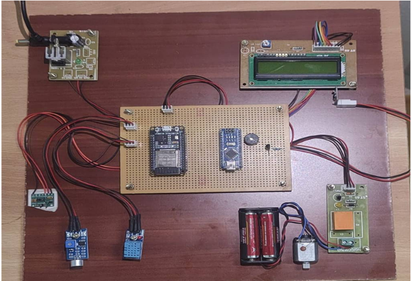
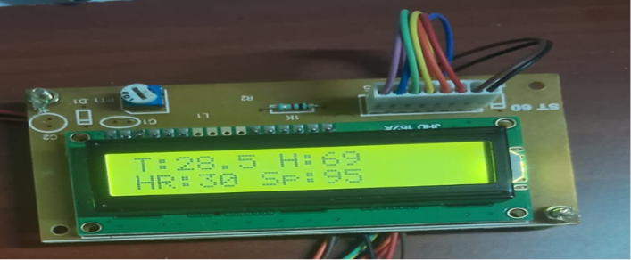
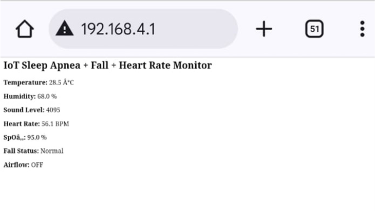

<div align="center">

# 🚑 Intelligent IoT Solution for Sleep Apnea

### IoT-Based Real-Time Sleep Apnea Detection and Monitoring System

An embedded healthcare system that continuously monitors physiological parameters, detects sleep apnea events, and provides automatic breathing assistance using **Arduino Nano**, **ESP32**, and **ThingSpeak IoT Cloud**.


</div>

---

# 📖 Overview

Sleep Apnea is a serious sleep disorder in which breathing repeatedly stops during sleep, potentially leading to severe health complications such as cardiovascular diseases, fatigue, and reduced cognitive performance.

This project presents an **Intelligent IoT Solution for Sleep Apnea** that continuously monitors a patient's physiological parameters including heart rate, blood oxygen level (SpO₂), respiration, temperature, humidity, and body movement. When abnormal breathing patterns are detected, the system automatically activates an air compressor to assist breathing while simultaneously uploading patient data to the **ThingSpeak Cloud** for remote monitoring.

---

# 🎯 Objectives

- Monitor patient vital signs continuously
- Detect Sleep Apnea events in real time
- Provide automatic breathing assistance
- Upload patient data to the cloud
- Enable remote healthcare monitoring
- Reduce snoring and improve breathing quality

---

# ✨ Key Features

- ❤️ Heart Rate Monitoring
- 🩸 SpO₂ Monitoring
- 🌬 Respiration Monitoring
- 🌡 Temperature & Humidity Monitoring
- 🛌 Body Movement Detection
- ☁️ ThingSpeak Cloud Integration
- 📟 LCD Live Display
- ⚡ Automatic Compressor Control
- 🔄 Automatic & Manual Modes
- 📡 Real-Time IoT Monitoring

---

# 🛠 Hardware Components

| Component | Purpose |
|------------|---------|
| Arduino Nano | Main Controller |
| ESP32 | Wi-Fi Communication |
| MAX30100 | Heart Rate & SpO₂ Sensor |
| Respiration Sensor | Breathing Detection |
| DHT11 | Temperature & Humidity |
| Accelerometer | Body Movement |
| Relay Module | Compressor Switching |
| Air Compressor | Airflow Assistance |
| LCD Display | Live Status Display |
| Power Supply | System Power |

---

# 💻 Software Used

- Arduino IDE
- Embedded C
- ThingSpeak IoT Platform

---

# 🧰 Technologies Used

- Arduino Nano
- ESP32
- IoT
- Embedded Systems
- ThingSpeak Cloud
- Embedded C
- MAX30100 Sensor
- DHT11 Sensor

---

# ⚙️ Working Principle

1. Initialize Arduino Nano and ESP32.
2. Read data from all sensors.
3. Process physiological parameters.
4. Compare readings with threshold values.
5. Detect abnormal breathing conditions.
6. Activate the air compressor when apnea is detected.
7. Display live readings on LCD.
8. Upload sensor data to ThingSpeak Cloud.
9. Continue continuous monitoring.

---

# 📊 System Workflow


---

# 🧩 Block Diagram


---

# 🔧 Hardware Prototype



---

# 📟 LCD Output



---

# ☁️ ThingSpeak Dashboard



---

# 🚀 Installation

Clone the repository.

```bash
git clone https://github.com/Baranidharan-Ece/Sleep-Apnea-Monitoring-using-IoT.git
```

Open the project in **Arduino IDE**.

Install the required libraries.

- MAX30100 Library
- DHT Library
- LiquidCrystal Library
- ESP32 Board Package
- WiFi Library

Select the correct board and COM Port.

Upload the code.

Power the hardware.

Open ThingSpeak to monitor live data.

---

# 📈 Results

✅ Real-time monitoring of patient health parameters

✅ Live LCD status display

✅ Automatic detection of abnormal breathing

✅ Automatic compressor activation

✅ Cloud-based remote monitoring

✅ Improved patient safety through continuous monitoring

---

# ✅ Advantages

- Low Cost
- Easy to Build
- Portable
- Real-Time Monitoring
- IoT Enabled
- Automatic Detection
- Remote Healthcare Support
- Low Power Consumption

---

# 🔮 Future Scope

- AI-based Sleep Apnea Prediction
- Mobile Application
- SMS & Emergency Alerts
- Firebase Cloud Integration
- Hospital Monitoring Dashboard
- Wearable Device Integration

---

# 📁 Repository Structure

```text
Sleep-Apnea-Monitoring-using-IoT/
│
├── README.md
├── LICENSE
├── Sleep_Apnea.ino
├── Working_Principle.md
│
└── images/
    ├── workflow.png
    ├── block_diagram.png
    ├── prototype.png
    ├── lcd_output.png
    └── webpage_output.png
```

---

# 🤝 Contributing

Contributions, suggestions, and improvements are always welcome.

1. Fork the repository.
2. Create a new branch.
3. Commit your changes.
4. Submit a Pull Request.

---

# 📄 License

This project is licensed under the **MIT License**.

---

# 👨‍💻 Author

### **Baranidharan S**

🎓 Electronics and Communication Engineering

🏫 V.S.B Engineering College, Karur

📧 **Email:** baranidharansnkdr@gmail.com

🔗 **LinkedIn:**  
https://www.linkedin.com/in/baranidharan-sanmugam-b6a3532a5/

🐙 **GitHub:**  
https://github.com/Baranidharan-Ece

---

<div align="center">

### ⭐ If you like this project, don't forget to Star this Repository!


</div>
